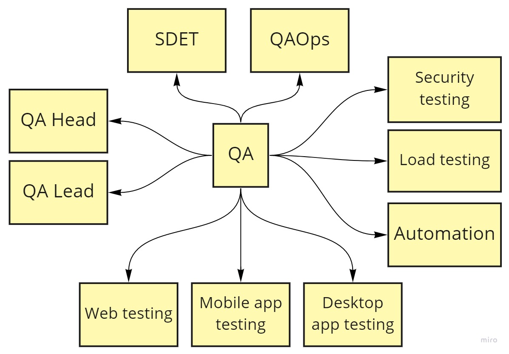

# qa-roadmap
Roadmap to becoming a quality assurance engineer  in 2021

# Общая документация
В данном репозитории описаны основные технические моменты. 
Помимо прочего данный репозиторий используется для дискуссий и принятия решений о новом функционале/процессах.

* Тематический контент [подробнее](docs/Topic.md)
* Литература [подробнее](docs/Books.md)
* Обучение [подробнее](docs/Courses.md)
* Блоги [подробнее](docs/Blogs.md)
* Инструменты [подробнее](docs/Tools.md)

Направления развития QA инженера

========================================================================

Web тестирование 

Теоретическая часть

Практические навыки

